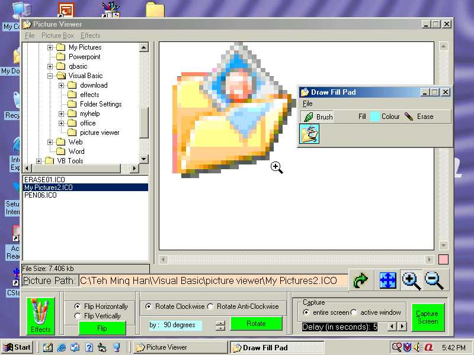



## Picture Viewer 2\.0  New Improved\-Draw Fill Pad, Effects, many MORE GREAT FEAURES\!

### Description

PICTURE VIEWER released!!Picture Viewer is a good & greatviewer for pictures, with advanced features such as (DRAW, FILL,-->IN DRAW FILL PAD), MAKE NEGATIVE, BLUR, BRIGHTER, DARKER,ZOOM IN & ZOOM OUT, FLIP, ROTATE, AN EXPLORER-LIKE DIRECTORY, SET PICTURE AS WALLPAPER, TAKE A SCREEN SHOT OF YOUR WINDOW OR DESKTOP, CHANGE TO ACTUAL SIZE, FILE SIZE, A TEXT BOX WHICH SHOWS THE PICTURE PATH AND FOR YOU TO ENTER THE PICTURE PATH, PRINT, SAVE, CUT, COPY, PASTE AND MANY MORE! So you will be impressed and PLEASE vote!!!!!!!!!VOTE!
 
### More Info
 

             |
---                |---
**Submitted On**   |2001-09-09 17:38:52
**By**             |[Ming Han](https://github.com/Planet-Source-Code/PSCIndex/blob/master/ByAuthor/ming-han.md)
**Level**          |Intermediate
**User Rating**    |4.9 (54 globes from 11 users)
**Compatibility**  |VB 6\.0
**Category**       |[Complete Applications](https://github.com/Planet-Source-Code/PSCIndex/blob/master/ByCategory/complete-applications__1-27.md)
**World**          |[Visual Basic](https://github.com/Planet-Source-Code/PSCIndex/blob/master/ByWorld/visual-basic.md)
**Archive File**   |[Picture Vi26169992001\.zip](https://github.com/Planet-Source-Code/ming-han-picture-viewer-2-0-new-improved-draw-fill-pad-effects-many-more-great-feaures__1-27099/archive/master.zip)

